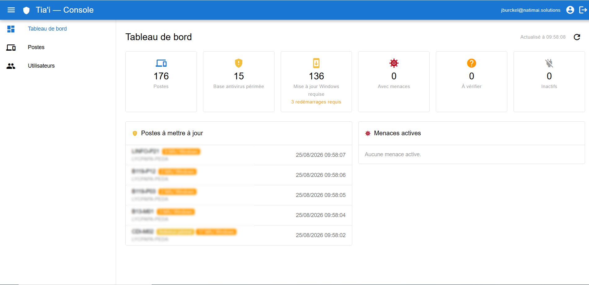
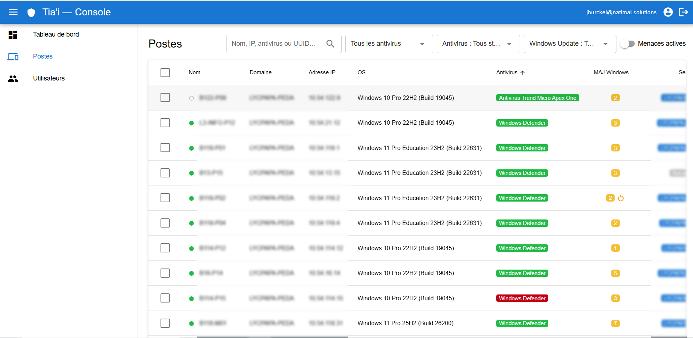

# Tia'i

[](https://github.com/Natimai-Solutions/natimai-tiai/actions/workflows/ci.yml)
[](https://github.com/Natimai-Solutions/natimai-Tiai/actions/workflows/ci.yml)
[](https://github.com/Natimai-Solutions/natimai-Tiai/actions/workflows/ci.yml)

> **Console de gestion de parc informatique** — pilotage centralisé d'un parc de postes Windows.
>
> *« Tīa'i »* — en reo tahiti : *gardien, vigile, garder, protéger.*

Tia'i collecte l'état des postes Windows d'un parc, déclenche des actions à
distance et présente le tout dans une console web. Un agent léger, déployé par
GPO, interroge le serveur à intervalle régulier : le serveur ne se connecte
jamais aux postes, ce qui traverse NAT et pare-feu sans ouvrir de flux entrant et
gère naturellement les postes éteints.

## Aperçu visuel





## Fonctionnalités

- **Microsoft Defender** — état des signatures et de la protection temps réel,
  historique des menaces, scan rapide ou complet et mise à jour des signatures
  déclenchables à distance, sur un poste ou sur tout le parc.
- **Windows Update** — mises à jour en attente poste par poste, installation à
  distance (pilotes inclus ou non), redémarrage requis signalé puis déclenché sur
  décision explicite — jamais automatiquement. Réinitialisation des composants
  Windows Update (procédure Microsoft) pour un poste qui ne se met plus à jour
  du tout.
- **Maintenance & diagnostic** — un catalogue fermé de commandes Windows
  courantes (stratégies de groupe, cache DNS, horloge, spouleur d'impression,
  vérification d'intégrité et de disque) et deux diagnostics en lecture seule
  dont la sortie s'affiche dans la console.
- **Alimentation** — redémarrage et arrêt à distance, chacun derrière une
  confirmation, annoncés à l'utilisateur connecté soixante secondes à l'avance et
  rationnés par l'agent lui-même. Et le retour : un réveil **Wake-on-LAN** émis
  par le serveur — le poste est éteint, il n'a plus d'agent à qui parler — vers
  l'adresse de diffusion de son propre sous-réseau, sur un poste ou sur toute une
  salle.
- **Vue du parc** — antivirus réellement actif sur chaque poste, y compris un
  produit tiers, adresse IP et session utilisateur ouverte : de quoi savoir qui
  est protégé, où joindre un poste et lequel est libre pour une intervention.
- **Supervision** — tableau de bord, recherche et filtres, nettoyage automatique
  des postes disparus. Le tableau de bord, la liste et la fiche d'un poste se
  rafraîchissent seuls, au rythme des remontées des agents.
- **E-mails, au rythme de chacun** — chaque compte choisit ce qu'il reçoit :
  rien, une alerte immédiate à chaque menace détectée, un résumé quotidien les
  jours où il y a à traiter, ou un résumé chaque matin — état du parc, antivirus
  périmés, correctifs critiques en attente. Un « rien à signaler » est aussi une
  information : c'est le réglage par défaut. Chaque e-mail passe par une file en
  base et est réessayé en cas d'incident d'envoi : un courrier décidé n'est
  jamais perdu.
- **Déploiement sans friction** — un binaire unique poussé par GPO,
  auto-enrôlement des postes, HTTPS de bout en bout.

## Architecture

```
   POSTES WINDOWS                     SERVEUR (docker compose)
 ┌──────────────────┐                 ┌──────────────────────────────┐
 │  Agent Tia'i     │      HTTPS      │  Caddy (TLS + proxy)         │
 │  (service Go)    │ ──────────────► │  Backend FastAPI + worker    │
 │                  │ ◄────────────── │  PostgreSQL                  │
 └──────────────────┘    commandes    │  Console web (Quasar / Vue)  │
           ▲                          └──────────────────────────────┘
           │ déploiement GPO
```

L'agent remonte l'état du poste à chaque appel ; la **même réponse** lui rend les
commandes en attente, qu'il exécute avant d'en poster le résultat. Aucun argument
ne traverse le réseau : le serveur n'envoie qu'un identifiant de commande, dont
l'exécution est figée dans le binaire de l'agent.

## Stack technique

| Couche | Choix |
|---|---|
| **Agent** | Go — binaire statique unique, service Windows, faible empreinte |
| **Backend** | FastAPI (async) + SQLAlchemy, API REST versionnée |
| **Base de données** | PostgreSQL — y compris la file d'e-mails (outbox) et les tâches de fond |
| **Console** | Quasar / Vue 3 |
| **Infra** | docker-compose + Caddy (reverse-proxy et terminaison TLS) |

## Feuille de route

| Module | État |
|---|---|
| Microsoft Defender | 🟢 Livré |
| Maintenance & diagnostic | 🟢 Livré |
| Windows Update | 🟢 Livré |
| Déploiement logiciel | ⚪ À venir |
| Inventaire matériel / logiciel | ⚪ À venir |

## Téléchargement

Chaque release publie l'agent Windows en `.exe` nu (déploiement par
[script de démarrage GPO](deploy/gpo/README.md)) et en installateur `.msi`
(GPO *Software Installation* ou pose manuelle — voir
[deploy/msi/](deploy/msi/README.md)). Liens directs vers la dernière version :

| | x64 | ARM64 |
|---|---|---|
| Agent `.exe` | [tiai-agent-windows-amd64.exe](https://github.com/Natimai-Solutions/natimai-tiai/releases/latest/download/tiai-agent-windows-amd64.exe) | [tiai-agent-windows-arm64.exe](https://github.com/Natimai-Solutions/natimai-tiai/releases/latest/download/tiai-agent-windows-arm64.exe) |
| Installateur `.msi` | [tiai-agent-windows-amd64.msi](https://github.com/Natimai-Solutions/natimai-tiai/releases/latest/download/tiai-agent-windows-amd64.msi) | [tiai-agent-windows-arm64.msi](https://github.com/Natimai-Solutions/natimai-tiai/releases/latest/download/tiai-agent-windows-arm64.msi) |

Vérifier l'empreinte téléchargée contre
[SHA256SUMS.txt](https://github.com/Natimai-Solutions/natimai-tiai/releases/latest/download/SHA256SUMS.txt) ;
les binaires versionnés de chaque release restent sur la page
[Releases](https://github.com/Natimai-Solutions/natimai-tiai/releases).

## Démarrage rapide

Le serveur s'installe via [Docker](https://www.docker.com/), disponible sur
Windows, macOS et Linux
([instructions d'installation](https://docs.docker.com/get-started/get-docker/)).
Il n'est pas nécessaire de connaître Docker : une fois installé, il télécharge et démarre
tous les composants — base de données, serveur, console web — en une seule
commande, sans rien d'autre à installer sur la machine.

```bash
cd deploy
cp .env.example .env        # renseigner les secrets, placer le certificat dans deploy/certs/
docker compose up -d        # db + backend + worker + console + caddy
```

Une variante dev/tests lève la même stack sans certificat. L'agent, lui, se
déploie par GPO sur les postes et s'enrôle tout seul au premier démarrage.

Les modes TLS, les variables d'environnement du serveur et les paramètres de
l'agent sont détaillés dans [DEPLOYMENT.md](DEPLOYMENT.md).

**Prérequis** : côté serveur, [Docker](https://www.docker.com/) et un certificat
émis par une AC approuvée des postes ; côté poste, Windows avec Defender actif
et un accès réseau au serveur.

## Sécurité

- **TLS de bout en bout** entre les postes et le serveur.
- **Auto-enrôlement contrôlé** : un secret partagé ne sert qu'à s'enregistrer,
  chaque poste reçoit ensuite un token qui lui est propre, révocable, chiffré sur
  le poste.
- **Console authentifiée** (JWT), journal d'audit et limitation de débit.
- **Catalogue de commandes fermé** : aucun exécuteur de scripts, aucune
  modification du registre, des fichiers, du pare-feu ou des comptes — un serveur
  compromis ne peut déclencher que les actions prévues.
- **Une commande à la fois par poste** : une même commande n'est pas remise en
  file tant que la précédente n'a pas rendu son verdict, et l'arrêt comme le
  redémarrage — les seules actions qui puissent coûter son travail à un
  utilisateur — sont en outre rationnés par l'agent lui-même, sur le poste, hors
  de portée du serveur.
- **Binaire agent signé** par le certificat de l'AC interne.

Pour signaler une vulnérabilité, contactez
[Natimai Solutions](https://www.natimai.solutions/contact) plutôt que d'ouvrir
une issue publique.

## Documentation

- [DEPLOYMENT.md](DEPLOYMENT.md) — déploiement, TLS, configuration du serveur et
  de l'agent.
- Chaque composant a son propre README : [agent/](agent/README.md),
  [backend/](backend/README.md), [frontend/](frontend/README.md).
- Le dossier [dev/](dev/) rassemble les documents de conception et de suivi du
  projet, pour qui veut le détail des choix techniques.

## Licence

Distribué sous licence **Apache 2.0**. Voir [LICENSE](LICENSE) pour le texte complet.

```
Copyright 2026 Natimai

Licensed under the Apache License, Version 2.0 (the "License");
you may not use this file except in compliance with the License.
You may obtain a copy of the License at

    http://www.apache.org/licenses/LICENSE-2.0
```
